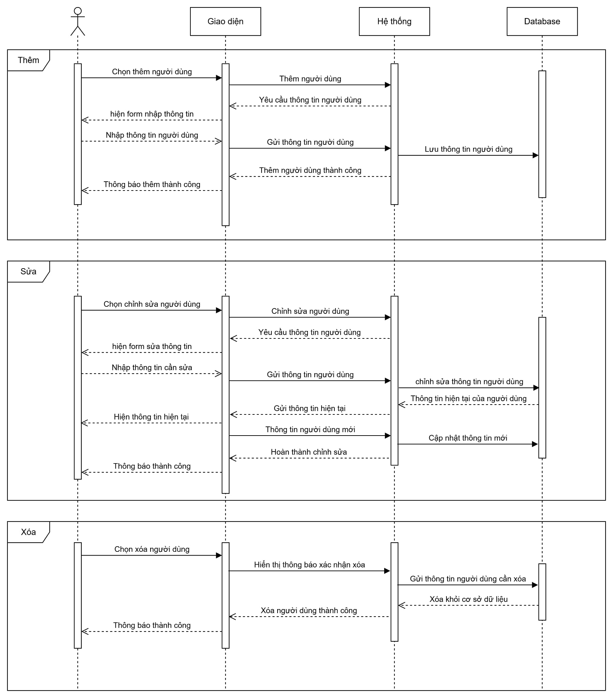
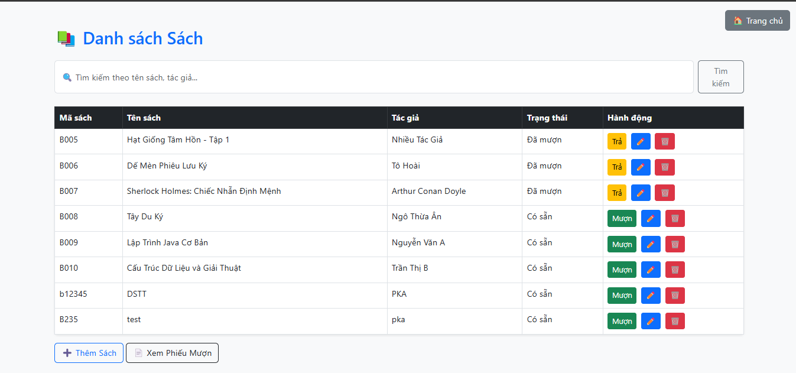
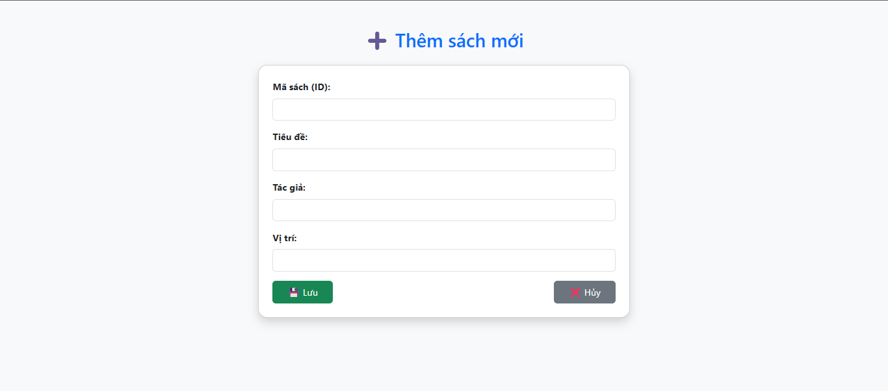
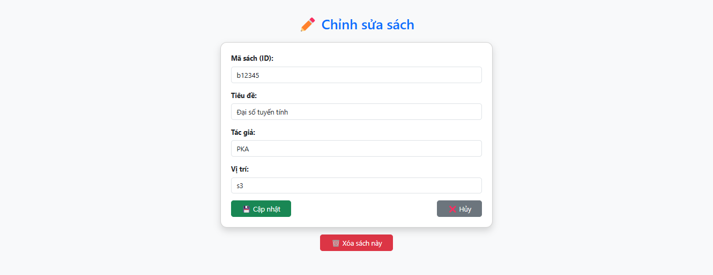
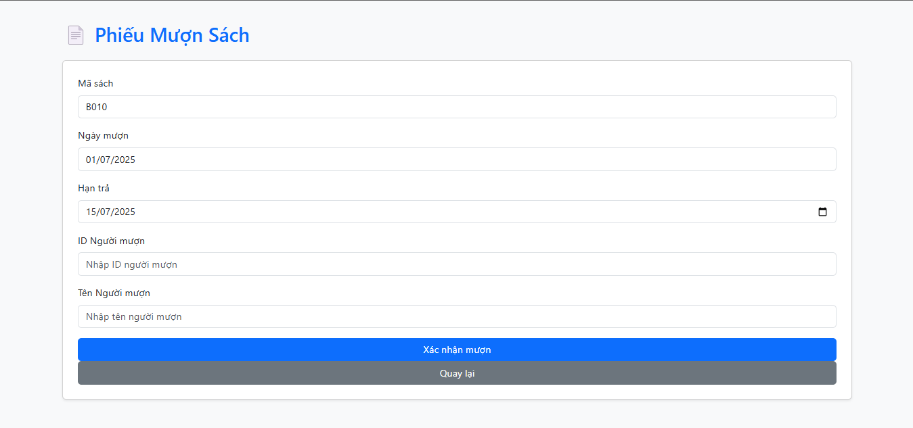
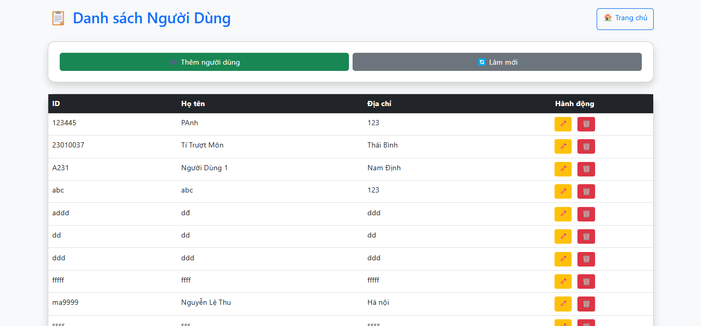
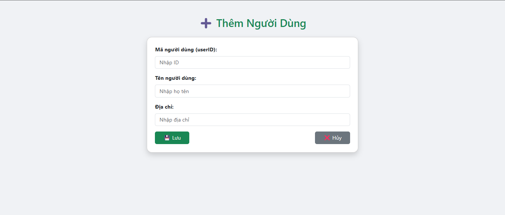
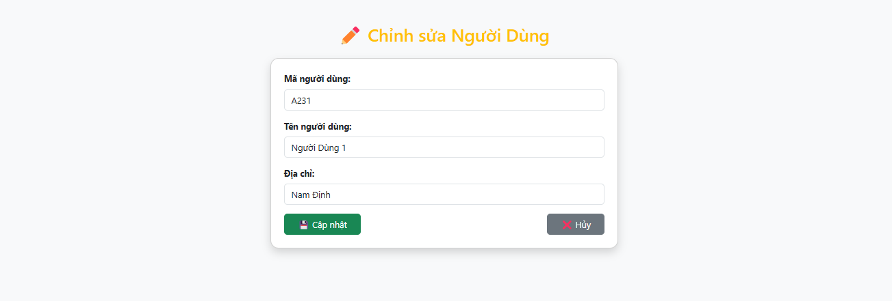
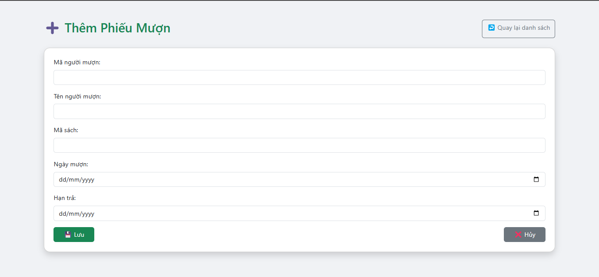
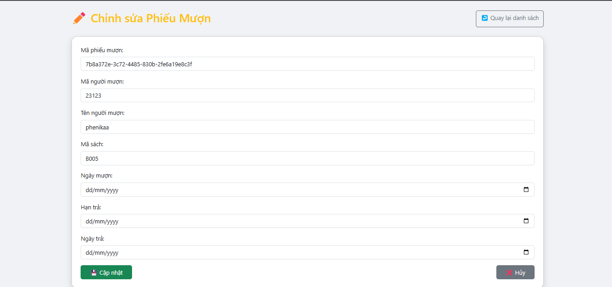

# Group 17 Project: 📚Xây dựng hệ thống quản lý thư viện
---------------
## 👥 Thành Viên:
* Tống Sỹ Đại | MSV: 	23010037
* Phạm Thị Phương Anh | MSV: 23010706
* Nguyễn Vũ Phụng Anh | MSV: 22010994
---------------
## 📌 Giới thiệu dự án:
Trong thời đại số hóa hiện nay, việc quản lý thư viện một cách hiệu quả trở nên vô cùng quan trọng để đáp ứng nhu cầu đọc và nghiên cứu ngày càng cao của cộng đồng. Các phương pháp quản lý thủ công truyền thống thường gặp phải nhiều hạn chế như mất thời gian, dễ xảy ra sai sót, khó khăn trong việc theo dõi thông tin sách, độc giả, và hoạt động mượn trả. Điều này gây ảnh hưởng không nhỏ đến chất lượng dịch vụ và trải nghiệm của người dùng.

Để giải quyết những thách thức trên, Hệ thống Quản lý Thư viện ra đời như một giải pháp công nghệ tối ưu. Đề tài này tập trung vào việc nghiên cứu, thiết kế và triển khai một hệ thống tự động hóa toàn diện, nhằm cải thiện đáng kể hiệu quả hoạt động của thư viện.
## 📖 Chức năng chính:
* **Quản lý sách:**
  - Quản lý thông tin của sách như tên, mã sách, vị trí và trạng thái của sách.
  - Hỗ trợ: tìm kiếm sách và thêm, sửa, xóa thông tin sách.
* **Quản lý người dùng:**
  - Quản lý thông tin của độc giả như tên, id người dùng, địa chỉ.
  - Hỗ trợ: thêm, sửa, xóa thông tin người dùng.
* **Quản lý phiếu mượn sách:**
  - Cập nhật thông tin của các phiếu mượn sách như ngày mượn, hạn trả và trạng thái đã trả hay chưa.
  - Hỗ trợ: thêm, sửa ,xóa thông tin phiếu mượn.

---------------
## 💻 Công nghệ sử dụng
* **Ngôn ngữ:** Java, HTML.
* **Cơ sở dữ liệu:** MySQL.
* **Framework:** Spring Boot.
----------------

## 🧩 UML
### Sequence Diagram	
**1. User**

**2. Book**

### Diagram

### Class Diagram

### Sơ đồ thuật toán

---------------

## Demo
### Giao diện hệ thống

### Giao diện quản lý sách

**1. Thêm sách**

**2. Chỉnh sửa thông tin sách**

**3. Mượn Sách**

### Giao diện quản lý người dùng

**1. Thêm người dùng**

**2. Chỉnh sửa thông tin người dùng**

### Giao diện quản lý phiếu mượn

**1. Tạo phiếu mượn mới**

**2. Chỉnh sửa thông tin phiếu mượn**

 
