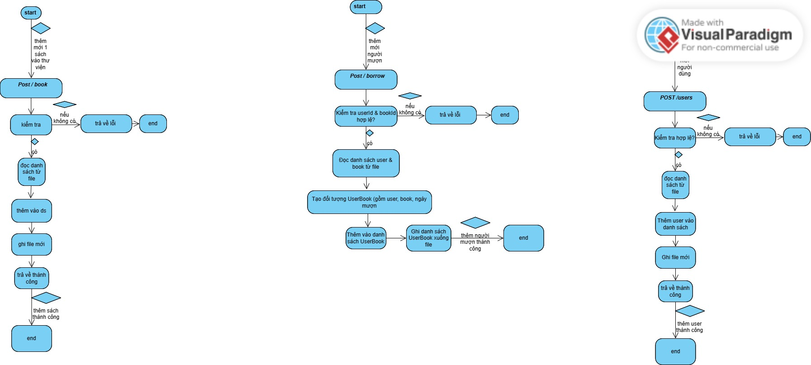
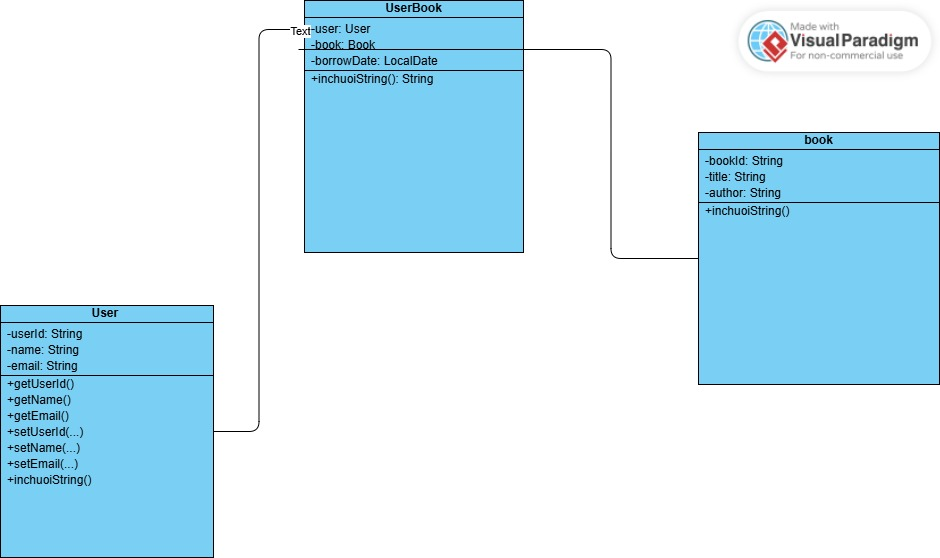
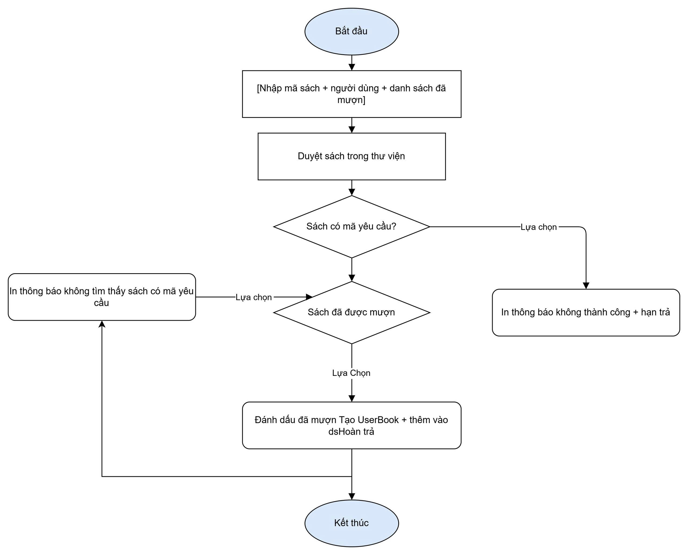
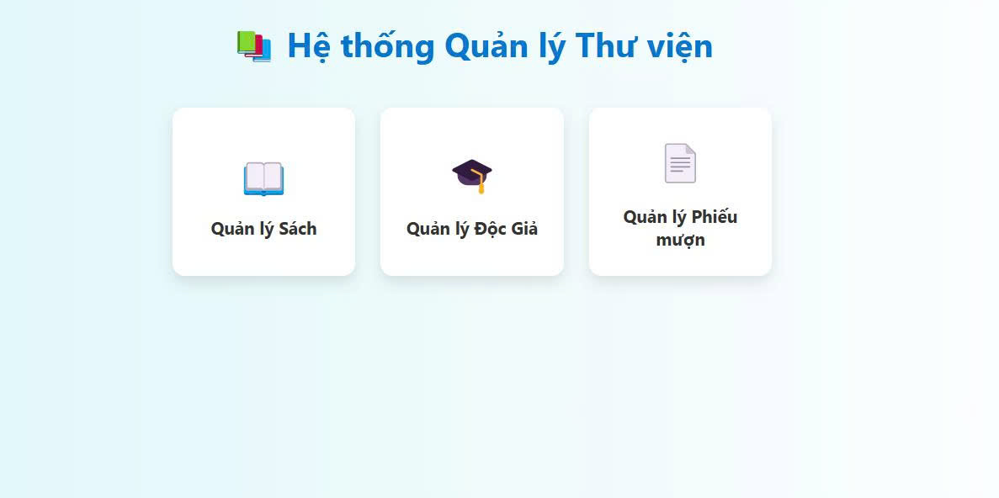

# Group 17 Project: Xây dựng hệ thống quản lý thư viện
-------------------
## Thành viên nhóm:
* Tống Sỹ Đại | MSV: 23010037
* Phạm Thị Phương Anh | MSV: 23010706
* Nguyễn Vũ Phụng Anh | MSV: 22010994
-------------------
## Giới thiệu về đề tài
Trong thời đại số hóa hiện nay, việc quản lý thư viện một cách hiệu quả trở nên vô cùng quan trọng để đáp ứng nhu cầu đọc và nghiên cứu ngày càng cao của cộng đồng. Các phương pháp quản lý thủ công truyền thống thường gặp phải nhiều hạn chế như mất thời gian, dễ xảy ra sai sót, khó khăn trong việc theo dõi thông tin sách, độc giả, và hoạt động mượn trả. Điều này gây ảnh hưởng không nhỏ đến chất lượng dịch vụ và trải nghiệm của người dùng.

Để giải quyết những thách thức trên, Hệ thống Quản lý Thư viện ra đời như một giải pháp công nghệ tối ưu. Đề tài này tập trung vào việc nghiên cứu, thiết kế và triển khai một hệ thống tự động hóa toàn diện, nhằm cải thiện đáng kể hiệu quả hoạt động của thư viện.
## Các tính năng chính
* **Quản lý sách**
  - Quản lý thông tin của sách như: mã sách, tên sách, tác giả, trạng thái sách.
  - Hỗ trợ tính năng tìm kiếm, thêm mới, chỉnh sửa và xóa thông tin sách.
* **Quản lý độc giả**
  - Quản lý thông tin của độc giả (user) như: id, họ tên, địa chỉ.
  - Hỗ trợ tính năng thêm mới, chỉnh sửa và xóa thông tin người dùng.
* **Quản lý phiếu mượn**
  - Cập nhật và theo dõi trạng thái của từng phiếu mượn sách.
  - Hỗ trợ tính năng thêm mới, chỉnh sửa và xóa thông tin phiếu mượn.
------------------
## Các đối tượng trong hệ thống

------------------

Behavioural Diagram (Sơ đồ chức năng / thuật toán) Người dùng có thể đăng ký tài khoản.

Behavioural Diagram (Sơ đồ chức năng / thuật toán)
Người dùng có thể đăng ký tài khoản.

Người dùng có thể tìm kiếm sách.

Người dùng có thể mượn và trả sách.

Hệ thống ghi lại lịch sử mượn sách.

 TongDai
Stage 1 Định nghĩa các class cơ bản:

User (Thông tin độc giả) Book (Thông tin sách) UserBook (Thông tin mượn sách) Stage 2 Bổ sung các hành vi (method) cơ bản cho các class: User Book UserBook Stage 3 Nâng cấp ứng dụng:

Stage 1
Định nghĩa các class cơ bản:

User (Thông tin độc giả)
Book (Thông tin sách)
UserBook (Thông tin mượn sách)
Stage 2
Bổ sung các hành vi (method) cơ bản cho các class:
User
Book
UserBook
Stage 3
Nâng cấp ứng dụng:
 

Thêm tính năng xử lý khi quá hạn trả sách (ví dụ tính phí phạt).

Thêm tìm kiếm sách theo tên tác giả, tiêu đề.

Quản lý số lượng sách thay vì chỉ trạng thái có/không.

Phát triển giao diện (Console hoặc GUI nhỏ).

link repo :https://github.com/tongDai-05/TongDai-K17-NO3_group17

 TongDai
# sơ đồ

## Sơ dồ hành vi

## sơ đồ class diagam

## sơ đồ mượn trả sách

----------------------
## Dao diện hệ thống

 
